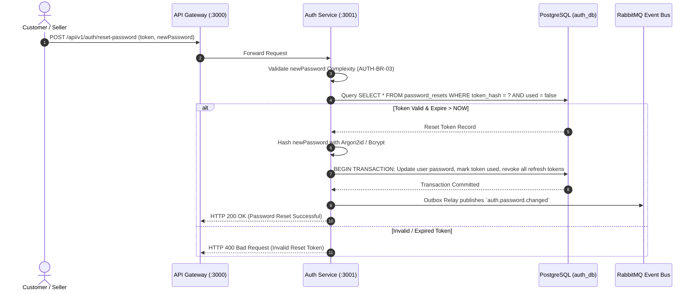

# Workflow: Reset Password Submission

---

# 1. Purpose

Resets user account password using validated token and revokes all active user sessions.

---

# 2. Scope

## Included

- Core process execution for Reset Password Submission.
- Validation of business constraints and request integrity.
- State persistence and event notification upon completion.

## Excluded

- Lower-level network routing and API Gateway authentication checks.
- Downstream asynchronous event processing beyond event publication.

---

# 3. Overview

| Property | Value |
|----------|--------|
| Domain | Authentication |
| Target Service | auth-service |
| Primary Actor | Client / User |
| Trigger | API Request / Event |
| Output | Process Status Response |

---

# 4. Actors

## Primary Actor

- Client / User

## Secondary Actors

- auth-service
- Database (auth_db)
- MessageBroker (RabbitMQ)

---

# 5. Trigger

Reset Password Submission is initiated via incoming client API request or internal message event.

---

# 6. Preconditions

The following conditions must be satisfied before execution.

- [ ] Target service (auth-service) is online and responsive.
- [ ] Database connection to auth_db is active.
- [ ] Request parameters comply with structural schema validation.

---

# 7. Main Flow

## Step 1

**Complexity Validation**: Verifies new password against rules (`AUTH-BR-03`).

---

## Step 2

**Token Verification**: Queries `auth_db` ensuring token exists, is unredeemed, and `expiresAt > NOW` (`AUTH-BR-12`).

---

## Step 3

**Password Update**: Hashes new password and updates user entity (`AUTH-BR-04`).

---

## Step 4

**Token Consumption**: Marks reset token `used: true` (`AUTH-BR-13`).

---

## Step 5

**Session Revocation**: Revokes ALL active refresh tokens for user ID (`AUTH-BR-14`).

---

## Step 6

**Notification Emission**: Emits `auth.password.changed` event for security email alert (`AUTH-BR-17`).

---

# 8. Alternative Flows

## Alternative Flow A

### Trigger

Service cache hit or pre-validated request payload.

### Flow

1. Read directly from cache store.
2. Bypass redundant database queries.
3. Return fast success response.

### Expected Result

Reduced latency response delivered to primary actor.

---

# 9. Exception Flows

## Exception A

### Cause

Invalid payload or business constraint violation.

### Handling

Returns HTTP 400/422 status error response.

### Result

Operation rejected without state modification.

---

# 10. Postconditions

## Success

- Workflow completed successfully with updated entity state.
- Audit log record created and domain events published.

## Failure

- Transaction rolled back completely without persistent side effects.
- Appropriate HTTP error status code returned to caller.

---

# 11. Sequence Diagram

---

# 12. State Changes

| Entity | Before | Action | After |
|----------|----------|----------|---------|
| Authentication Entity | Initial State | Reset Password Submission | Updated State |

---

# 13. Data Changes

## Created

- Audit log entry.
- Domain event record (outbox table).

## Updated

- Target entity attributes in auth_db.

## Deleted

- Temporary session or cache entry (if applicable).

---

# 14. Database Operations

| Table | Operation | Description |
|----------|------------|-------------|
| auth_records | UPDATE | Persists updated state for Reset Password Submission |
| outbox_events | INSERT | Records domain event for event bus relay |

---

# 15. Cache Operations

| Cache Key | Operation | Description |
|------------|------------|-------------|
| auth:cache | EXPIRE | Invalidates or refreshes relevant cache entry |

---

# 16. Search Index Operations

| Index | Operation | Description |
|--------|-----------|-------------|
| auth_index | UPDATE | Syncs index with primary database record |

---

# 17. External Systems

| System | Purpose |
|----------|----------|
| API Gateway | Entry point routing and rate limiting |
| RabbitMQ | Event bus for async event publication |

---

# 18. API Endpoints

| Method | Endpoint | Description |
|----------|-----------|-------------|
| POST | /api/v1/auth/reset-password | Executes Reset Password Submission |
---

# 19. Events

## Published Events

| Event | Description |
|---------|-------------|
| auth.password.changed | Emitted upon successful execution of Reset Password Submission |
---

## Consumed Events

| Event | Description |
|---------|-------------|
| None | No domain events consumed |
---

# 20. Business Rules

Reference Business Rule IDs only.

- AUTH-BR-04

- AUTH-BR-03

- AUTH-BR-14

- AUTH-BR-13

- AUTH-BR-12

- AUTH-BR-17

---

# 21. Related Use Cases

- AUTH-UC-06

---

# 22. Security Considerations

## Authentication

Requires valid bearer JWT token or microservice secret header.

---

## Authorization

Requires appropriate role-based permission check.

---

## Input Validation

Enforces strict JSON schema validation for all payload parameters.

---

## Sensitive Data

Masks personally identifiable information (PII) in log output.

---

## Audit Logging

Records structured audit log containing actor ID, IP address, timestamp, and action.

---

## Rate Limiting

Applies standard API gateway rate limits.

---

# 23. Performance Considerations

## Expected Throughput

1000 requests per minute under nominal load.

---

## Expected Latency

Sub-100ms response time at p95 percentile.

---

## Caching Strategy

Utilizes Redis for session and hot entity caching.

---

## Retry Strategy

Implements exponential backoff retry for transient network faults.

---

## Timeout Strategy

Enforces strict 5-second timeout on downstream service calls.

---

## Concurrency

Uses optimistic concurrency locking or Redis distributed locks.

---

# 24. Compensation

On workflow failure, database transaction is rolled back. If external side effects occurred, a compensating event is dispatched to restore consistent system state.

---

# 25. Observability

## Logging

Emits structured JSON logs tagged with Correlation-ID and Trace-ID.

---

## Metrics

Exposes Prometheus counters for total executions, failures, and execution duration.

---

## Distributed Tracing

Propagates W3C Trace Context headers across RPC and messaging boundaries.

---

## Monitoring

Included in main domain Grafana dashboard.

---

## Alerting

Triggers alert on error rate exceeding 2% over 5-minute window.

---

# 26. Error Codes

| Code | Description |
|---------|-------------|
| INVALID_INPUT | Request payload failed schema validation |
| ENTITY_NOT_FOUND | Target record does not exist |
| INTERNAL_ERROR | Unexpected system error during execution |

---

# 27. Assumptions

- Dependent database and Redis infrastructure are healthy and accessible.
- Network latency between microservices remains within acceptable limits.

---

# 28. Limitations

- Workflow execution is bounded by API Gateway request timeout limits.

---

# 29. Dependencies

## Internal Services

- auth-service

---

## External Systems

- API Gateway
- Event Broker (RabbitMQ)

---

## Infrastructure

- PostgreSQL (auth_db)
- Redis Cache

---

# 30. References

## ADR

- ADR-001 (Architecture Governance)

---

## Business Rules

- AUTH-BR-04

- AUTH-BR-03

- AUTH-BR-14

- AUTH-BR-13

- AUTH-BR-12

- AUTH-BR-17

---

## Use Cases

- AUTH-UC-06

---

## API Documentation

- Open API 3.0 Specs

---

## Architecture Documentation

- System Architecture Specification

---

## Database Documentation

- Data Model Schema Documentation

---

# 31. Notes

Implementation must follow established clean architecture and domain-driven design patterns.

---

# 32. Revision History

| Version | Date | Author | Changes |
|----------|------------|------------|-------------|
| 1.0.0 | 2026-07-28 | Architecture Team | Initial standardized version |
