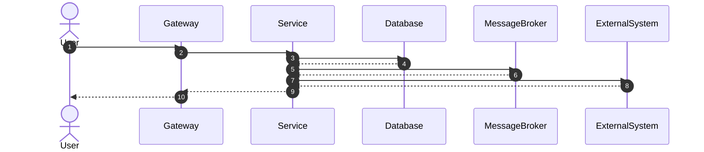

# Workflow Document Template

This document defines the standard structure for all Workflow documents.

Every workflow MUST follow this template.

---

```yaml
---
id:

name:

description:

version:

status:

domain:

target_service:

owner:

reviewer:

priority:

critical:

estimated_complexity:

tags: []

use_cases: []

business_rules: []

api: []

adr: []

published_events: []

consumed_events: []

related_workflows: []

created:

updated:
---
```

---

# Workflow: <Workflow Name>

---

# 1. Purpose

Describe the business objective of this workflow.

---

# 2. Scope

## Included

-

-

-

## Excluded

-

-

-

---

# 3. Overview

| Property | Value |
|----------|--------|
| Domain | |
| Target Service | |
| Primary Actor | |
| Trigger | |
| Output | |

---

# 4. Actors

## Primary Actor

-

## Secondary Actors

-

-

---

# 5. Trigger

Describe what starts this workflow.

Examples

- HTTP Request
- Kafka Event
- Scheduled Job
- Internal Event
- Webhook

---

# 6. Preconditions

The following conditions must be satisfied before execution.

- [ ]
- [ ]
- [ ]

---

# 7. Main Flow

## Step 1

Description

---

## Step 2

Description

---

## Step 3

Description

---

## Step N

Description

---

# 8. Alternative Flows

## Alternative Flow A

### Trigger

### Flow

### Expected Result

---

## Alternative Flow B

### Trigger

### Flow

### Expected Result

---

# 9. Exception Flows

## Exception A

### Cause

### Handling

### Result

---

## Exception B

### Cause

### Handling

### Result

---

# 10. Postconditions

## Success

-

-

-

## Failure

-

-

-

---

# 11. Sequence Diagram



---

# 12. State Changes

| Entity | Before | Action | After |
|----------|----------|----------|---------|
| | | | |

---

# 13. Data Changes

## Created

-

-

## Updated

-

-

## Deleted

-

-

---

# 14. Database Operations

| Table | Operation | Description |
|----------|------------|-------------|
| | INSERT | |
| | UPDATE | |
| | DELETE | |

---

# 15. Cache Operations

| Cache Key | Operation | Description |
|------------|------------|-------------|
| | SET | |
| | DELETE | |
| | EXPIRE | |

---

# 16. Search Index Operations

| Index | Operation | Description |
|--------|-----------|-------------|
| | CREATE | |
| | UPDATE | |
| | DELETE | |

---

# 17. External Systems

| System | Purpose |
|----------|----------|
| | |

---

# 18. API Endpoints

| Method | Endpoint | Description |
|----------|-----------|-------------|
| | | |

---

# 19. Events

## Published Events

| Event | Description |
|---------|-------------|
| | |

---

## Consumed Events

| Event | Description |
|---------|-------------|
| | |

---

# 20. Business Rules

Reference Business Rule IDs only.

- BR-001

- BR-002

---

# 21. Related Use Cases

- UC-001

- UC-002

---

# 22. Security Considerations

## Authentication

Description

---

## Authorization

Description

---

## Input Validation

Description

---

## Sensitive Data

Description

---

## Audit Logging

Description

---

## Rate Limiting

Description

---

# 23. Performance Considerations

## Expected Throughput

Description

---

## Expected Latency

Description

---

## Caching Strategy

Description

---

## Retry Strategy

Description

---

## Timeout Strategy

Description

---

## Concurrency

Description

---

# 24. Compensation

Describe rollback or Saga compensation if applicable.

Example

Payment Failed

↓

Release Inventory

↓

Cancel Order

↓

Publish OrderCancelled

---

# 25. Observability

## Logging

Description

---

## Metrics

Description

---

## Distributed Tracing

Description

---

## Monitoring

Description

---

## Alerting

Description

---

# 26. Error Codes

| Code | Description |
|---------|-------------|
| | |

---

# 27. Assumptions

-

-

-

---

# 28. Limitations

-

-

-

---

# 29. Dependencies

## Internal Services

-

-

---

## External Systems

-

-

---

## Infrastructure

-

-

---

# 30. References

## ADR

-

---

## Business Rules

-

---

## Use Cases

-

---

## API Documentation

-

---

## Architecture Documentation

-

---

## Database Documentation

-

---

# 31. Notes

Additional implementation notes.

---

# 32. Revision History

| Version | Date | Author | Changes |
|----------|------------|------------|-------------|
| 1.0.0 | YYYY-MM-DD | | Initial Version |